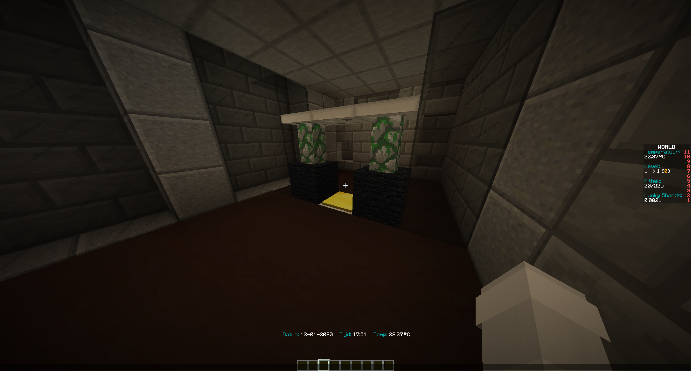
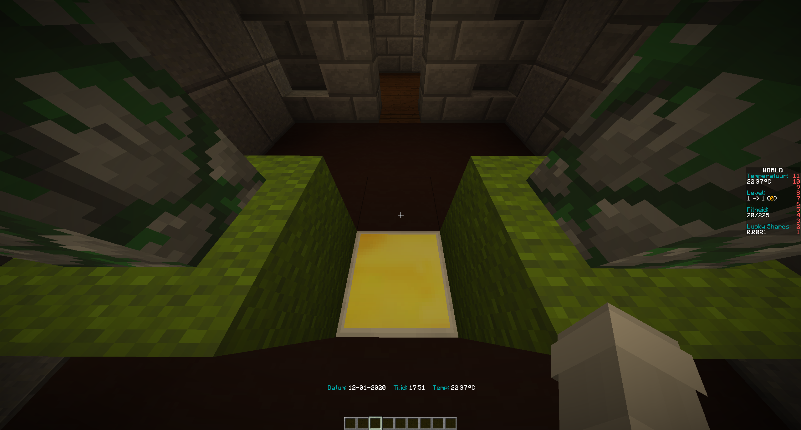

# Detectiongate setup

You can use detectiongates to see if someone is carrying illegal items, such as weapons. You could use detectiongates near a police station, army base or a prison.

## How do you create a detectiongate?



Place an iron block on the floor and put a golden pressure plate on top of it. Add one or more black wool blocks above or next to the iron block.



## Config

```yml
DetectionGate:
  Items:
  - SUGAR
  - IRON_HOE
  - STICK
  - WOODEN_SWORD
  - SPIDER_EYE
  - FERMENTED_SPIDER_EYE
  - SNOWBALL
  - ARROW
  - BOW
  - ROTTEN_FLESH
  - STONE_HOE
  - POISONOUS_POTATO
  ToggleGateRange: 3
  WoolblockChangeRadius: 4
```
At ``Items`` you can change the materials that trigger the detectiongates, at ``ToggleGateRange`` you can set the radius where fencegates should open and at ``WoolblockChangeRadius` you can set the radius where the wool blocks need to change color.