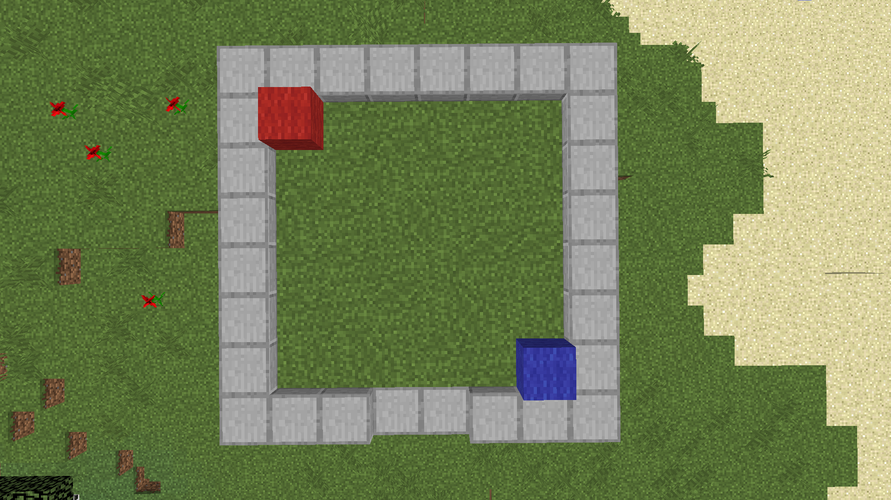

# Plots

Met plots kan je spelers een eigen plekje geven, waar zij in kisten kunnen of deuren kunnen openen. Voor bijvoorbeeld een huis of winkel.
## Hoe maak je een plot? (Rechthoekig)

Begin als eerste met het command ``/plotwand krijg`` uit te voeren, met deze wand kan jij plots maken, permissie: ``minetopiasdb.plotwand``

Hou je plotwand in je hand en klik met je linkermuisknop op de eerste hoek van je plot (Zie rode blokje op foto)
Klik hierna met je rechtermuisknop op de andere hoek van je plot (Zie blauwe blokje op de foto)

Voer vervolgens het command ``/padd <naam van het plot>`` uit.

## Hoe maak je niet rechthoekige plots?

Als je niet rechthoekige plots wilt maken, kan je het beste even **[deze video](https://www.youtube.com/watch?v=-xOFv5cJUXI)** kijken
## Het /plot command

| Permissie                        | Beschrijving |
| :------------------------------- | :----------- |
| minetopiasdb.plot.addowner       | Voeg een speler toe als eigenaar van een plot |
| minetopiasdb.plot.removeowner    | Verwijder een speler als eigenaar van een plot |
| minetopiasdb.plot.addmember      | Voeg een speler toe als member op plots (deze permissie is **NIET** nodig als je plot eigenaar bent) |
| minetopiasdb.plot.removemember   | Verwijder een speler als member op plots (deze permissie is **NIET** nodig als je plot eigenaar bent) |
| minetopiasdb.plot.tp             | Teleporteer naar een plot |
| minetopiasdb.plot.clear          | Verwijder alle (mede-)eigenaars van een plot |
| minetopiasdb.plot.inactive       | Krijg een lijst van alle inactieve plots |
| minetopiasdb.plot.list           | Krijg een lijst van alle vrije plots en alle plots van een speler |
| minetopiasdb.plot.calculate      | Bereken de prijs van een plot |
| minetopiasdb.plot.setdescription | Verander de beschrijving van een plot |
