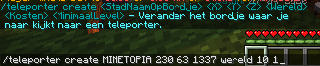

# Teleporters

De MinetopiaSDB plugin heeft ondersteuning voor teleporters waarmee je gemakkelijk door de hele stad kan reizen.

## Commands

Je kunt een teleporter aanmaken door naar een bordje te kijken en dit commando uit te voeren: 
``/teleporter create <Naam op bordje> <X> <Y> <Z> <Wereld> <Kosten> <Min. Level>``

Teleporters kun je verwijderen door het bordje van de teleporter kapot te slaan. Om een teleporter bruikbaar te maken moet je een heavy weighted pressure plate onder het bordje plaatsen.

