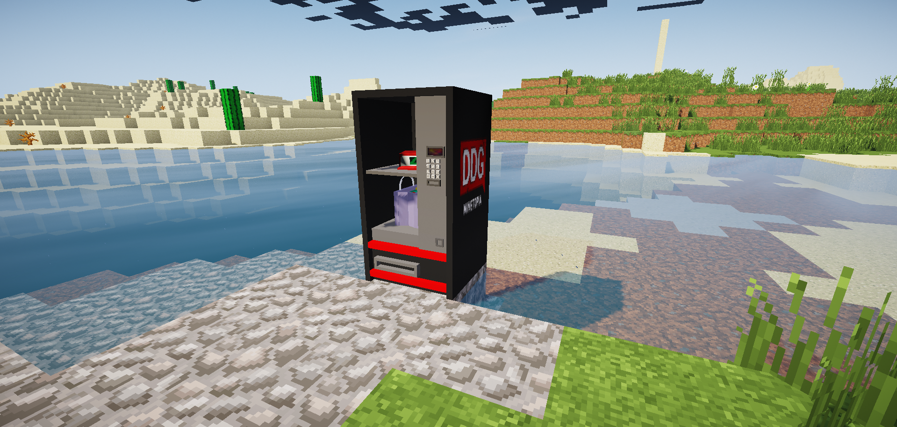

# Vendingmachine

De MinetopiaSDB plugin heeft vendingmachines waarmee je drie verschillende soorten goodybags kan kopen met grayshards, luckyshards of goldshards (aanpasbaar in de config).
De inhoud van de drie soorten goodybags (normal, epic en legendary) is aanpasbaar met het ``/lootcrate items <normal/epic/legendary>`` commando.
Je kunt een vendingmachine plaatsen door een piston neer te zetten, en hier eventueel een barrier blok boven op te plaatsen.

## Config
Standaard ziet het VendingMachine kopje in de config er zo uit: 
```
VendingMachine:
  GoodyBag:
    Item: DIAMOND_HOE:999
  Enabled: true
  ItemCount: 4
  ShardType: LUCKYSHARD
  PriceFormat: '0.0000'
  NormalPrice: 1
  EpicPrice: 2
  LegendaryPrice: 5
```
Om de vendingmachines met een ander type shard te laten werken kun je de waarde aanpassen naar ``LUCKYSHARD``, ``GRAYSHARD`` of ``GOLDSHARD``. Let op, deze waardes veranderen **niet** mee als je je shards hernoemt.

Het is handing om ook in de ``Messages.yml`` de berichten bij het kopje ``VendingMachine:`` aan te passen, omdat de standaardteksten uitgaan van het gebruik van LuckyShards.


